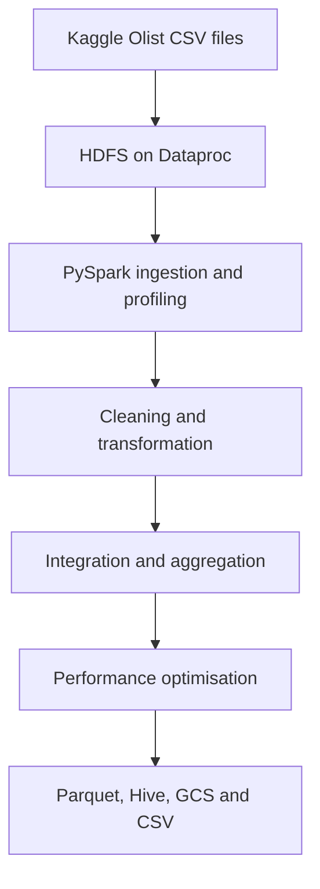

# Olist E-Commerce Data Engineering with Apache Spark

An end-to-end data engineering project built with **PySpark** on **Google Cloud Dataproc** using the Brazilian Olist e-commerce dataset. The project follows a five-stage workflow: data ingestion and exploration, cleaning and transformation, integration and aggregation, performance optimisation, and data serving.

## Project objectives

- Ingest multiple CSV datasets from HDFS into Spark DataFrames.
- Profile schemas, record counts, null values, duplicates, and key business distributions.
- Clean and standardise customer, order, payment, and product data.
- Integrate related datasets into a consolidated order-level dataset.
- Calculate customer, seller, product, delivery, and revenue metrics.
- Apply Spark performance techniques such as caching, broadcast joins, repartitioning, and Adaptive Query Execution.
- Store curated data in Parquet, Hive tables, Google Cloud Storage, and CSV format.

## Architecture



## Dataset

The project uses the [Brazilian E-Commerce Public Dataset by Olist](https://www.kaggle.com/datasets/olistbr/brazilian-ecommerce), consisting of nine related CSV files:

- Customers
- Orders
- Order items
- Order payments
- Order reviews
- Products
- Sellers
- Geolocation
- Product category translations

## Project notebooks

| Part | Notebook | Main work completed |
| --- | --- | --- |
| 1 | [Data Ingestion and Exploration](Part%201%20-%20Data%20Ingestion%20and%20Exploration.ipynb) | Creates a Spark session, reads nine CSV sources from HDFS, inspects schemas and counts, checks nulls and duplicate customer IDs, and explores customer states, order statuses, payment types, product sales, and delivery times. |
| 2 | [Data Cleaning and Transformation](Part%202%20-%20Data%20Cleaning%20and%20Transformation.ipynb) | Handles missing values, applies mean and median imputation, standardises dates and payment labels, casts data types, removes duplicates, filters price outliers using approximate quantiles, creates product-size categories, joins datasets, and writes cleaned Parquet outputs. |
| 3 | [Data Integration and Aggregation](Part%203%20-%20Data%20Integration%20and%20Aggregation.ipynb) | Integrates orders, items, products, sellers, customers, geolocation, reviews, and payments; uses caching and broadcast joins; calculates customer, seller, and product KPIs; applies window ranking; and enriches records with status, revenue, customer-segment, hour, and day-type features. |
| 4 | [Performance Optimisation](Part%204%20-%20Property%20Optmization.ipynb) | Configures Spark resources and SQL settings for a Dataproc cluster, enables Adaptive Query Execution, tunes shuffle and file partitions, and explores broadcast, sort-merge, repartitioned, and skew-aware join strategies. |
| 5 | [Data Serving](Part%205%20-%20Data%20Serving.ipynb) | Reads the processed Parquet dataset and serves curated data through HDFS Parquet, Google Cloud Storage, a Hive managed table, and CSV output. |

## Key transformations and analytics

- Reusable null-value profiling across DataFrames
- Critical-field filtering and duplicate removal
- Mean and median imputation using `pyspark.ml.feature.Imputer`
- Date conversion and categorical value standardisation
- Price-outlier filtering using the 1st and 99th percentiles
- Multi-table joins across the Olist data model
- Customer order count, total spending, and average order value
- Seller revenue, order count, average review score, and price variability
- Product sales, revenue, average price, price volatility, and seller coverage
- Customer retention indicators using first and last order dates
- Top products by seller using Spark window functions
- Order-status flags, order revenue, customer segments, hourly demand, and weekday/weekend features

## Performance techniques

- Caching frequently reused DataFrames
- Broadcast joins for selected lookup datasets
- Repartitioning by join keys
- Sorting within partitions
- Adaptive Query Execution and partition coalescing
- Configurable shuffle partitions and default parallelism
- Broadcast join threshold and file partition tuning
- Memory allocation settings for the target Dataproc cluster

## Technologies

- Python and PySpark
- Apache Spark and Spark SQL
- Google Cloud Dataproc
- HDFS and Google Cloud Storage
- Hive
- Parquet and CSV
- Jupyter Notebook

## Running the project

1. Download the Olist dataset from Kaggle.
2. Upload and extract the CSV files into HDFS.
3. Update `hdfs_path` in the notebooks so that it matches your dataset location.
4. Run the notebooks sequentially from Part 1 through Part 5.
5. Update the Google Cloud Storage destination in Part 5 before writing output.

Example HDFS directory:

```text
/data/olist/
```

The notebooks use overwrite mode when writing several outputs. Review the destination paths before running those cells.

## Repository structure

```text
Data-Engineering-Spark-/
├── Part 1 - Data Ingestion and Exploration.ipynb
├── Part 2 - Data Cleaning and Transformation.ipynb
├── Part 3 - Data Integration and Aggregation.ipynb
├── Part 4 - Property Optmization.ipynb
├── Part 5 - Data Serving.ipynb
└── README.md
```

## Author

**Saurabh Arun Bhagat**

